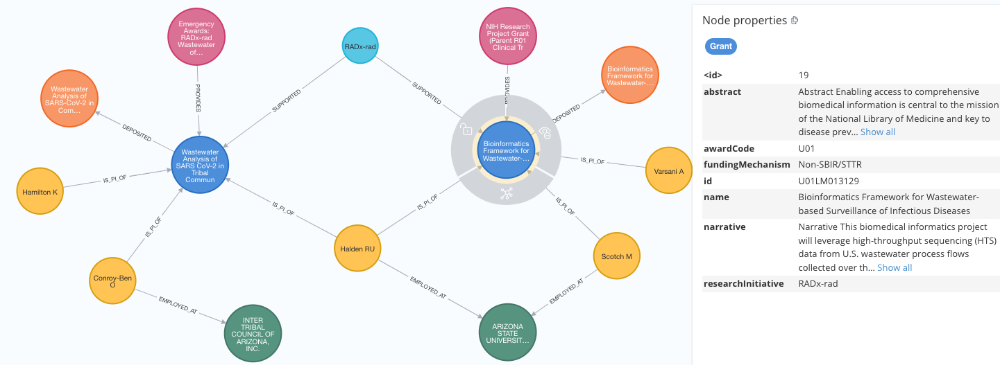

# RADx Digital Assets Knowledge Graph

**[WORK IN PROGRESS]**

The RADx Digital Assets Knowledge Graph (radx-kg) collects and links assets from the National Institutes of Health (NIH) [Rapid Acceleration of Diagnostics (RADx®)](https://www.nih.gov/research-training/medical-research-initiatives/radx). The goal of the RADx initiative is to speed innovation in the development, commercialization, and implementation of technologies for COVID-19 testing.

The RADx initiative includes the follwing projects:
- [RADx Radical (RADx-rad)](https://www.nih.gov/research-training/medical-research-initiatives/radx/radx-programs#radx-rad)
- [RADx Digital Health Technologies (RADx-DHT)](https://www.nih.gov/news-events/news-releases/nih-awards-contracts-develop-innovative-digital-health-technologies-covid-19)
- [RADx Tech (RADx-TECH)](https://www.nih.gov/research-training/medical-research-initiatives/radx/radx-programs#radx-tech)
- [RADx Underserved Populations (RADx-UP)](https://www.nih.gov/research-training/medical-research-initiatives/radx/radx-programs#radx-up)

The radx-kg links the following assets:
- [Funding Opportunities](kg/data/nodes/FundingOpportunity.csv)
- Funding Agencies
- [Grants](kg/data/nodes/Grant.csv)
- [Researchers](kg/data/nodes/Researcher.csv)
- [Organizations](kg/data/nodes/Organization.csv)
- [CoordinationCenters](kg/data/nodes/CoordinationCenter.csv)
- Publications
- [Datasets](kg/data/nodes/Dataset.csv)
- Data Dictionaries
- Patents
- Emergency Use Authorizations (EUAs)
- Software Products
- Viral Quality Assurance Panels

## Meta Graph

The meta graph show the relationships among the nodes. The Grant node is selected to display its metadata in the right panel. (Click on image for a higher-resolution view).

## Example Subgraphs

Subgraph of two wastewater projects with one Grant node selected to display its properties.

Entire subgraph of the RADx-rad project assets. The right panel shows the legend for the node labels and relationship types.

## Directories and Files

| Directory | Description| 
| ----------| ---------- |
| data      | Manually maintained files with core information to seed the Knowledge Graph |
| derived_data | Intermediate data files used during development |
| kg        | Node and relationship data and metadata files to create the Knowledge Graph | 
| scripts   | scripts to generate the Neo4j Knowledge Graph |

## Citation
RADx-Rad Discoveries & Data: Consortium Coordination Center (DCC), RADx Digital Assets Knowledge Graph (radx-kg), Available online: https://github.com/radxrad/radx-kg (2023).

## Funding
Development of this application was supported by the OFFICE OF THE DIRECTOR, NATIONAL INSTITUTES OF HEALTH:

**RADx-Rad Discoveries & Data: Consortium Coordination Center Program Organization** ([7U24LM013755](https://reporter.nih.gov/project-details/10745886))
