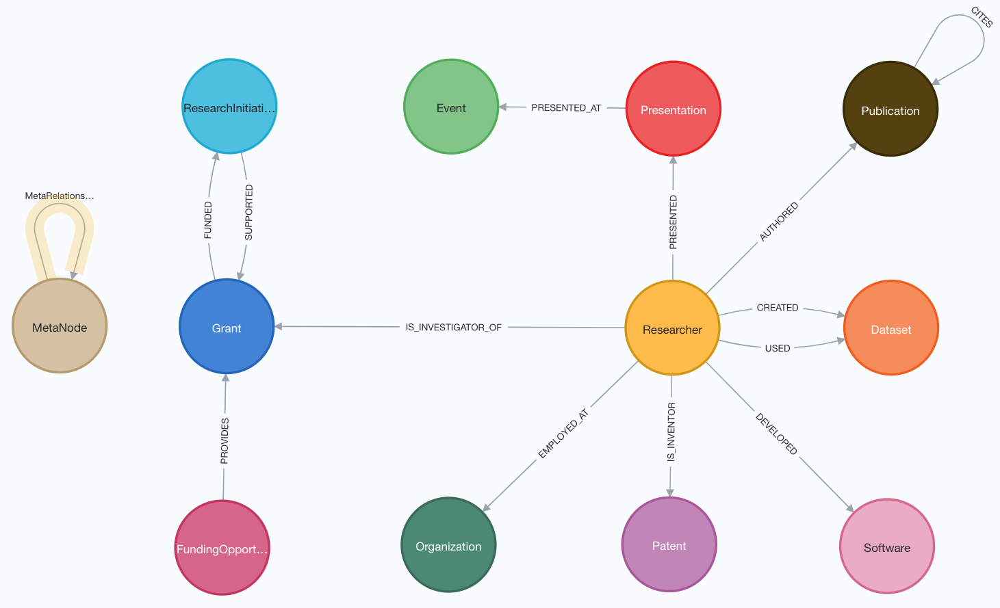
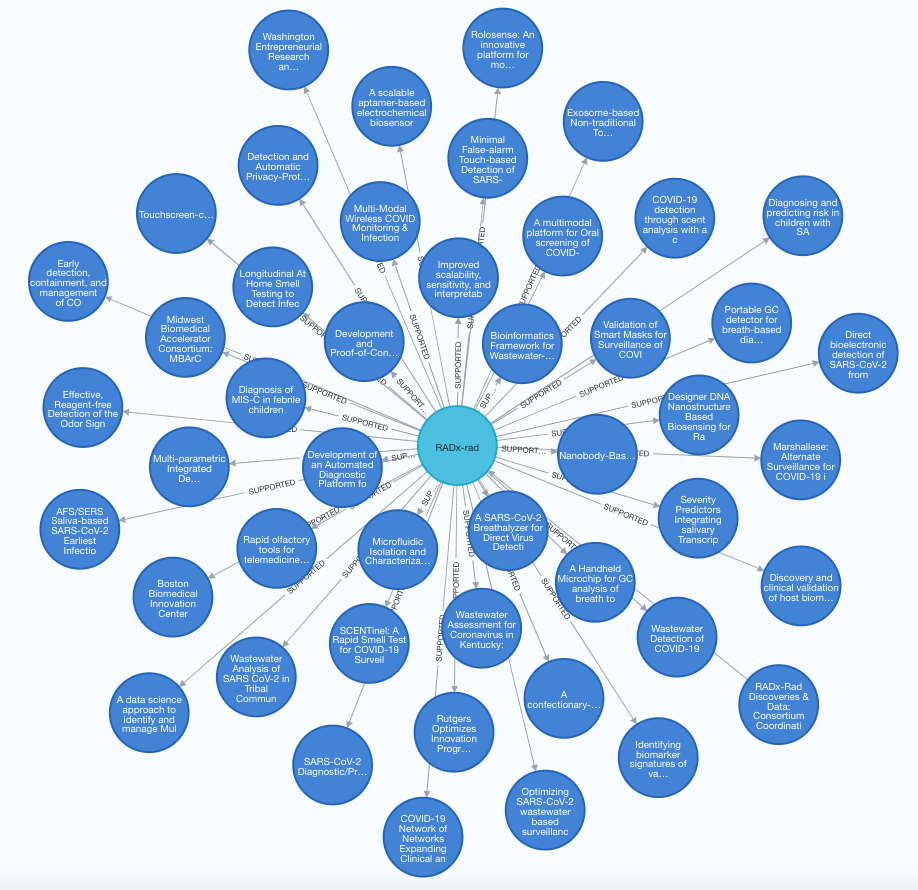

# RADx Digital Assets Knowledge Graph

**[WORK IN PROGRESS]**

The RADx Digital Assets Knowledge Graph (radx-kg) collects and links assets from the National Institutes of Health (NIH) [Rapid Acceleration of Diagnostics (RADx®)](https://www.nih.gov/research-training/medical-research-initiatives/radx) initiative. The goal of this initiative is to speed innovation in the development, commercialization, and implementation of technologies for COVID-19 testing.

The RADx initiative includes the follwing projects:
- [RADx Radical (RADx-rad)](https://www.nih.gov/research-training/medical-research-initiatives/radx/radx-programs#radx-rad)
- [RADx Digital Health Technologies (RADx-DHT)](https://www.nih.gov/news-events/news-releases/nih-awards-contracts-develop-innovative-digital-health-technologies-covid-19)
- [RADx Tech (RADx-TECH)](https://www.nih.gov/research-training/medical-research-initiatives/radx/radx-programs#radx-tech)
- [RADx Underserved Populations (RADx-UP)](https://www.nih.gov/research-training/medical-research-initiatives/radx/radx-programs#radx-up)

The radx-kg links the following assets:
- [Funding Opportunities](kg/data/nodes/FundingOpportunity.csv)
- [Grants](kg/data/nodes/Grant.csv)
- [Researchers(PIs)](kg/data/nodes/Researcher_investigators.csv)
- [Researchers(coauthors)](kg/data/nodes/Researcher_primary_coauthors.csv)
- [Organizations](kg/data/nodes/Organization.csv)
- [ResearchInitiatives](kg/data/nodes/ResearchInitiative.csv)
- [Publications (primary)](kg/data/nodes/Publication_primary.csv)
- [Publications (secondary)](kg/data/nodes/Publication_secondary.csv)
- [Datasets](kg/data/nodes/Dataset.csv)
- [Software](kg/data/nodes/Software_manually.csv)
- [Patents](kg/data/nodes/Patent.csv)
- [Presentations](kg/data/nodes/Presentation.csv)
- [Events](kg/data/nodes/Event.csv)

## Meta Graph
Click on the images below for a higher-resolution view.

<p align="center">

</p>

Figure 1: The metagraph shows the relationships among the nodes (digital assets).

## Example Subgraphs


<p align="center">

</p>

Figure 2: Projects supported by the RADx-rad DCC

<p align="center">

</p>

Figure 3: Subgraph for PI John Cirrito.

<p align="center">

</p>

Figure 4: Extended Subgraph for PI John Cirrito with paper citations and dataset usages.

## Explore the radx-kg
Click on the ```Open in Colab``` button below to launch a Jupyter Notebook and run queries on the radx-kg.

**RADx-rad Explorer**
[RADx-rad_Explorer.ipynb](notebooks/visualization/RADx-rad_Explorer.ipynb) <a target="_blank" href="https://colab.research.google.com/github/radxrad/radx-kg/blob/main/notebooks/visualization/RADx-rad_Explorer.ipynb">  </a>

**AMIA 2024 Notebook**
[AMIA-2024.ipynb](notebooks/visualization/AMIA-2024.ipynb) <a target="_blank" href="https://colab.research.google.com/github/radxrad/radx-kg/blob/main/notebooks/visualization/AMIA-2024.ipynb">  </a>

## Directories and Files

| Directory | Description| 
| ----------| ---------- |
| data      | Manually maintained files with core information to seed the Knowledge Graph |
| kg        | Node and relationship data and metadata files to create the Knowledge Graph | 
| scripts   | scripts to generate the Neo4j Knowledge Graph |

## Citation
RADx-Rad Discoveries & Data: Consortium Coordination Center (DCC), RADx Digital Assets Knowledge Graph (radx-kg), Available online: https://github.com/radxrad/radx-kg (2023).

## Funding
Development of this application was supported by the OFFICE OF THE DIRECTOR, NATIONAL INSTITUTES OF HEALTH:

**RADx-Rad Discoveries & Data: Consortium Coordination Center Program Organization** ([U24LM013755](https://reporter.nih.gov/project-details/10745886))
